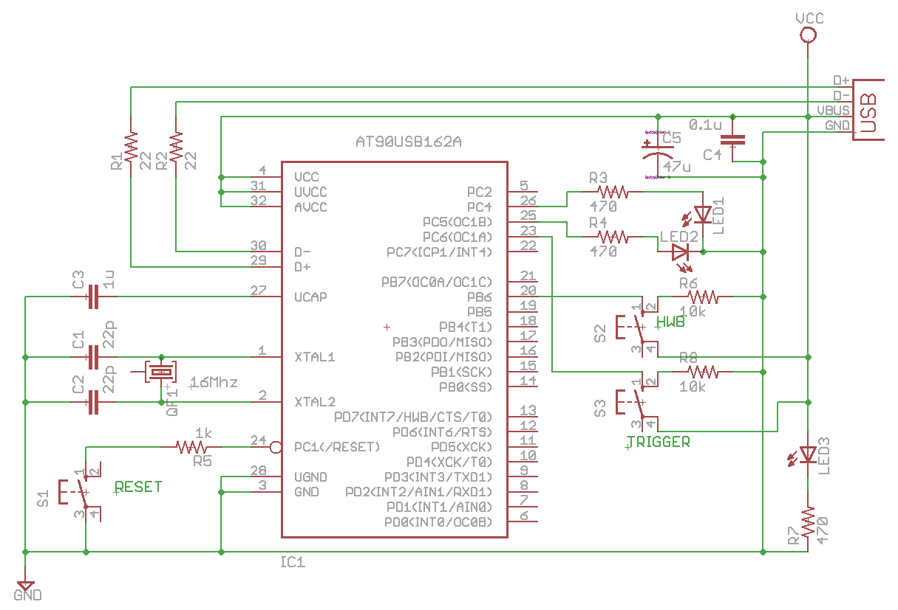

# lufamiditest

This is a simplify fork code for study to LUFA from lufa/Demos/Device/ClassDriver/MIDI

# base (LUFA)

see [LUFA (Lightweight USB Framework for AVRs)](http://www.fourwalledcubicle.com/LUFA.php)

# schematic

